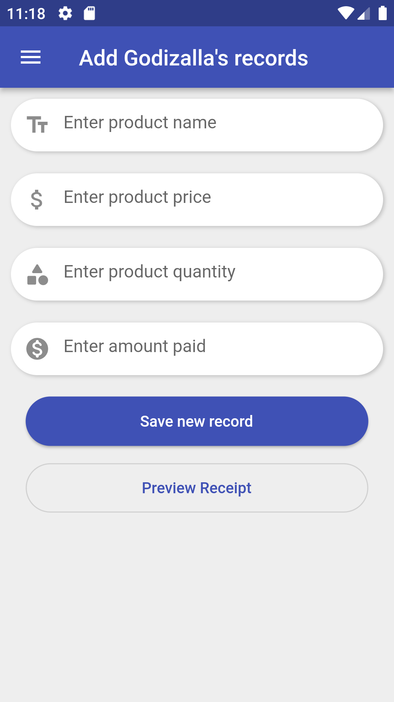

## Receipt Generator
[](https://codemagic.io/apps/6288af8cd44138e2fceba223/6288af8cd44138e2fceba222/latest_build)

## Getting Started
```
  git clone https://github.com/Mugamba669/generate_receipt.git
```
## Then run

```
   cd generate_receipt
```
```
   flutter pub get
```
```
   flutter run -v
```
## Screenshots





